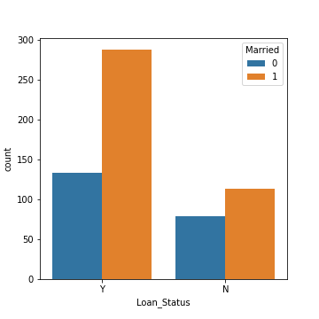
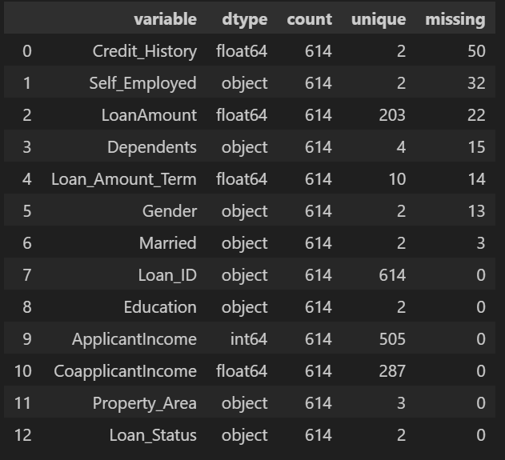
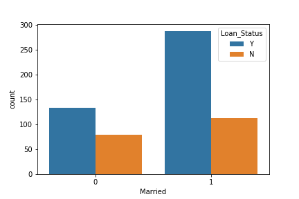

<h1 align="center">Loan Status Prediction App</h1>

# Table of Contents

- [Project Explanation](#project-explanation)
  - [Data Collection](#data-collection)
  - [Feature Engineering](#feature-engineering)
  - [Feature Selection](#feature-selection)
  - [Building Machine Learning Models](#building-machine-learning-models)
  - [Model Performance](#model-performance)
  - [Building Optimum Model](#building-optimum-model)
  - [Test data Predictions](#test-data-predictions)

### Data Collection
- The dataset is collected from [Kaggle](https://www.kaggle.com/altruistdelhite04/loan-prediction-problem-dataset).
- The dataset which we get from kaggle consists of two CSV(Comma Separated Values) files.
  - One is Train Data (`train_u6lujuX_CVtuZ9i.csv`)
  - Another is Test Data (`test_Y3wMUE5_7gLdaTN.csv`)
  
- The Training data consists of 614 applicant samples and 12 features.
- The 12 features are Loan_ID, Gender, Married, Dependents, Education, Self_Employed, ApplicanIncome, CoapplicantIncome, LoanAmount, Loan_Amount_Term, Credit_History and Property Area.
- The target prediction is the Loan_Status
- The dataset in train kinda imbalanced for each classes in Loan_Status.

As the image above shows, it contains `NaN` values or missing values. We should fill these missing values, and various techniques for doing so will be covered in the Feature Engineering part.

### Feature Engineering
Let's dive deeper into the 12 features that might be used to predict the Loan_Status

**1. Load_ID**
- Load_ID is used to generally identify each of applicant. So, it doesn't matter and we can ignore it.

**2. Gender**
- Gender is a **nominal** kind of **qualitative** data, because there is no numerical relation between different genders.
- There are 13 applicants that not mentioned their gender.
- The unique values are male and female.
- What values that should be filled in the null? There are few ways to do so, but I will use model predictions to determine which values should be filled.

- `The question is which features that will be used?`
  - Most of these people are married. So we can't fill Gender based on `Married` column.
  - Most of these people are graduated. So we can't fill Gender based on `Education` column.
  - Most of these people are self employed. So we can't fill Gender based on `Self_Employed` column.
  - Most of these people are having `Credit_History` and `Loan_Amount_Term` as 360 days(1 year).
  - Since we are going to predict applicant's Gender, we can omit CoapplicantIncome
  - So we are going predict the Gender based on `Dependents`, `ApplicantIncome`, `LoanAmount`, and `Property_Area`
  - I will using `KNNClassifier` to predict the Gender

- Don't forget to turn the categorical data of Gender *Male* and *Female* into numberical data. Im using `Label Encoder `from SKLearn

**3. Married**
- Since there are 2 only values like Gender which are `Yes` and `No` it represents binary kind of qualitative data
- For 3 applicants, Married status is not mentioned
- By extracting the samples having null values on Married columns separately, I am able to get the folowing details :
  - Those 3 applicants are Graduated, Not Self_Employed, and having Credit History.
  - Applied for different Loan_Amount_Term - 360, 240 and 480
  - The property area is Semiurban for 2 applicants and Urban for 1 applicant.
  - Loan is approved for all 3 applicants.
  

- Most of Married People are getting loan approved same as Education too
- So, we can fill the value with `Married`
- Because mostly we deal with numerical data then we should encode it from Categorical data to Numerical data.

**4. Education**
- Since there are 2 only values like Gender which are `Graduate` and `Not Graduate` it represents binary kind of qualitative data
- All aplicants fill the value with total of Graduate        (*480*)
Not Graduate    (*134*)
- Because mostly we deal with numerical data then we should encode it from Categorical data to Numerical data.

**5. Dependants**
- I assume that dependants means that number of children that have married.
- The Dependents feature is a discrete kind of quantitative data.
- For 15 applicants, Dependents is not mentioned in the data.
- There are 4 unique values present in this feature. They are 0, 1, 2, and 3+.
- Fill the missing values not married with 0 and married 1 or 2. Because of most married people have 1 or 2 children.

**6. Self-Employed**
- The Self_Employed column is a binary kind of qualitative data. Because there are only two values possible in this feature. They are Self_Employed and Not Self_Employed.
- For 32 applicants, Self_Employed status is not mentioned in the data
- The two binary values are Yes and No.
- Nearly 86% percentage of the applicant are not self employed. So we can easily fill it with not self employed.

**7. Applicant_Income**
- The Applicant Income column is a continuous kind of quantitative data.
- All the applicants provided their Applicant Income.

- From the above distplot, most of the Applicants income less than Rs.10,000 and some considerable amount of applicants having income between Rs.10,000 and Rs.20,000.

- `Should We drop the outlier?`
  - If you drop the outlier the model will not capable predicting loan_status that have higher income than others.

**8. Co-applicant_Income**
- The Co-applicant Income column is a continuous kind of quantitative data.
- All the applicants provided their Co-applicant Income.

- From the above dist plot most of the co-applicant income is zero or nearer to zero

**9. LoanAmount**

- The LoanAmount Income column is a continuous kind of quantitative data.
- For 22 applicants, the LoanAmount are not mentioned in the data.
- Tips to fill NA values can be seen by comparing with another feature distribution.
- Because of our target is Loan_Status. Then we using mean of LoanAmount for each Loan_Status classes.

**10. Loan_Amount_Term**
- The Loan_Amount_Term column is a discrete kind of quantitative data.
- For 14 applicants, the Loan_Amount_Term is not included in the data.
- The different Loan_Amount_Terms are 12, 3, 60, 84, 120, 180, 240, 300, 360 and 480.
- Nearly 83 % of applicants choose to 360 Term
- We can fill the null values by 360

**11. Credit_History**
- It is a binary kind of qualitative data.
- For 50 applicants, the Credit_History are not mentioned in the data.
- Most of applicant that have credit history are tend to be approbved
- So we fill the null values based on the Loan_Status

**12. Property_Area**
- The Property_Area column is a ordinal kind of qualitative data.
- All the applicants given their Property_Area.
The ordinal datas present in this column are Urban, Semiurban and Rural.
- Dont forget to change it to numerical data

